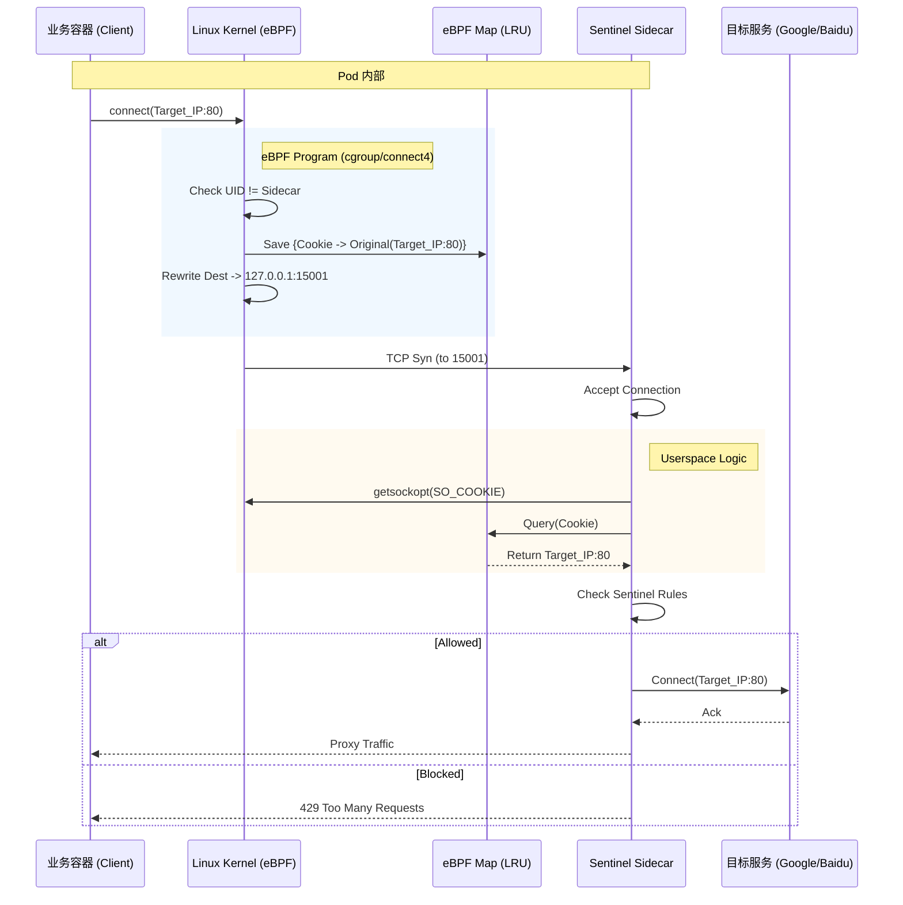

# eBPF 流量拦截架构详解

## 1. 核心流程示意图

## 2. 交互细节

### A. 部署变更 (Deployment)
从 `deploy/demo-app-ebpf.yaml` 可以看到主要变化：
1.  **移除 init-container**: 不再需要 `iptables` 初始化脚本。
2.  **特权模式 (Privileged)**: Sidecar 容器需要 `privileged: true` (或 CAP_BPF) 来加载内核程序。
3.  **挂载 Cgroup**: 必须挂载宿主机的 `/sys/fs/cgroup`，因为 eBPF 程序是挂载到 Cgroup 根节点来实现对整个 Pod (或容器) 流量拦截的。

### B. Map 交互机制
1.  **Shared Memory**: eBPF Map 是一块内核与用户态共享的内存区域。
2.  **Key (Cookie)**: `SO_COOKIE` 是内核为每个 Socket 分配的唯一标识符。连接建立时，eBPF 程序和 Sidecar 都能拿到这个 ID。
3.  **Value**: 原始目标地址。因为 eBPF 修改了 TCP 包的目标地址为 Sidecar，Sidecar 接收到连接时只知道是发给自己的 (127.0.0.1)，必须查表找回原主。

## 3. 常见问题
*   **为什么需要挂载 Cgroup?**
    *   我们的 eBPF 程序类型是 `cgroup/connect4`，它依赖 Cgroup 事件触发。在 K8s 中，我们需要将程序 Attach 到容器所在的 Cgroup 路径上。
*   **Sidecar 重启了怎么办?**
    *   Map 里的数据存在内核内存中。如果不 Pin (持久化) Map，Sidecar 进程退出 Map 就会消失。但这通常没问题，因为 Sidecar 挂了连接也就断了，新连接会由新 Sidecar 重新建立 Map 条目。
