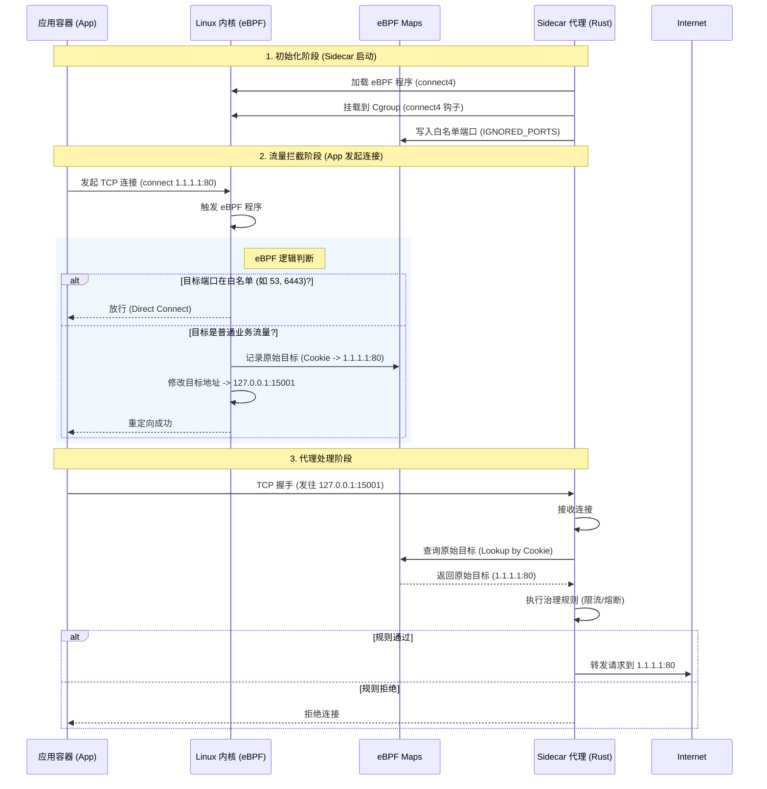

# masSentinel eBPF 流量拦截原理解析

本文档详细解释了 masSentinel Sidecar 如何利用 eBPF (Extended Berkeley Packet Filter) 技术透明地拦截和重定向容器内的网络流量。

## 核心流程图

## 详细步骤解析

整个系统分为两个部分：运行在内核态的 **eBPF 程序** 和运行在用户态的 **Sidecar 程序**。

### 1. 启动与挂载 (Userspace -> Kernel)
*   **代码位置**: `src/bpf.rs`
*   **动作**: Sidecar 启动时，会读取编译好的 eBPF 字节码 (`mas-sentinel-ebpf`)。
*   **关键点**: 它将 eBPF 程序 "挂载" (Attach) 到一个 **Cgroup** 上。Linux 内核允许我们在 Cgroup 的网络操作（如 `connect`）上挂钩子。一旦挂载成功，该 Cgroup 下所有进程（即整个 Pod 内的应用）发起的 TCP 连接都会先经过我们的 eBPF 代码。

### 2. 拦截与重定向 (Kernel eBPF)
*   **代码位置**: `ebpf/src/main.rs`
*   **触发时机**: 当应用发起 `connect()` 系统调用时（例如 `curl google.com`）。
*    **白名单检查**: 为了防止误伤（如 K8s 健康检查、DNS 查询），我们先检查目标端口是否在 `IGNORED_PORTS` Map 中。如果是，直接放行 (`return Ok(1)`)。
*   **保存现场**: 如果需要拦截，我们首先要把**主要目标地址**（应用原本想去哪里，例如 1.2.3.4:80）保存下来。我们用 `bpf_get_socket_cookie` 获取当前 Socket 的唯一标识 (Cookie)，然后把 `{Cookie -> 原始IP:端口}` 写入 `CONNECT_ORIG_DST` Map。
*   **偷梁换柱**: eBPF 修改内核数据结构，将目标 IP 改为 `127.0.0.1`，目标端口改为 `15001`（Sidecar 监听端口）。
*   **结果**: 应用以为自己在连外网，实际上内核悄悄把光缆插到了 Sidecar 身上。

### 3. 还原目标 (Userspace Sidecar)
*   **代码位置**: `src/proxy/outbound.rs` & `src/bpf.rs`
*   **接收连接**: Sidecar 在 15001 端口收到连接。
*   **查询原地址**: Sidecar 拿到这个连接的 Socket，也能提取出同样的 **Cookie**。它用这个 Cookie 去查询 `CONNECT_ORIG_DST` Map，找回应用原本想去的 `1.2.3.4:80`。
*   **代理转发**: Sidecar 知道了原始目标，就可以根据 Sentinel 的规则决定是直接转发流量，还是限流拒绝。

## 为什么这样做？
传统做法（如 Istio 早期）使用 `iptables`。`iptables` 需要数据包要在内核协议栈里走多圈（Conntrack 等），性能损耗大。
eBPF 方案直接在 Socket 层拦截，路径最短，性能最高，且不需要给容器 `NET_ADMIN`（特权）能力（只需 `CAP_BPF`，且目前我们需要 `mount` 权限是因为还没做到完美容器化，后续会优化）。
